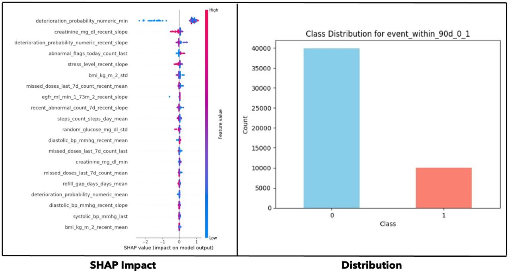

# 🩺 AI-Driven Risk Prediction Engine for Chronic Care Patients  

> Submission for **Hackwell**  

---

## 🚩 Problem Statement  

Chronic care management often involves tracking dozens of vitals, labs, lifestyle indicators and adherence events over months.  
Clinicians and care teams want to know **“which patient is likely to deteriorate in the next 90 days?”** so they can proactively intervene.

Key challenges:

- Fragmented multi-modal data: static demographics + longitudinal vitals + behavioral signals.
- Severe class imbalance: very few deterioration events vs many stable periods.
- Need for **calibrated probabilities** and **transparent explanations** to support clinical decision making.

Our goal:  
> **Predict the probability of patient deterioration within 90 days using 30–180 days of historical data, and surface the drivers of risk.**

---

## 📊 Synthetic Dataset Creation  

Because real patient data is protected, we built a **rich synthetic dataset generator** that simulates:

- **Static profile**: age, sex, height/weight/BMI, comorbidities (diabetes, hypertension, CHF, CKD, COPD), smoking, medications, labs.
- **Daily time-series**: vitals (BP, HR, SpO₂), labs, adherence (missed doses, refill gaps), activity (steps, sleep), stress, symptom flags, utilization events.
- **Risk score**: heuristic combining comorbidities + vitals/labs trends.
- **Ground truth**: probability of deterioration = sigmoid(α + β·risk_score_raw), sampled into a binary `event_within_90d` label.

Output:  
A single Excel workbook `synthetic_chronic_dataset.xlsx` with one sheet per patient containing day-level rows.

---

## 🛠️ Model Approach  

We treat the problem at **two levels**:

1. **Aggregated features per patient** (last values, mean, std, min/max, slopes over last 30 days).  
   - Trained **Random Forest** and **XGBoost** on these tabular features.
2. **Sequential modeling** of the raw time series.  
   - Built a **90-step LSTM** (with masking + dropout) to learn temporal patterns directly.

### Pipeline Steps  

- **Column cleaning & flexible detection** of `patient_id` and `event_within_90d`.
- **Forward-fill imputation** per patient, then median for numeric; “unknown” for categorical.
- **Label encoding** for categorical features (encoders saved for reuse).
- **Feature aggregation** with recent-window slopes (30 days by default).
- **GroupShuffleSplit** train/test by patient to prevent leakage.
- **StandardScaler** for numeric features (joblib saved).
- **Model training**:
  - RandomForestClassifier (200 trees, max_depth=8).
  - XGBoost (binary:logistic, eta=0.05, max_depth=6, early stopping).
  - LSTM (64 units, dropout=0.3, EarlyStopping patience=10).

### Explainability  

- **SHAP** for XGBoost (TreeExplainer + summary plot).
- **Feature importances** for Random Forest.
- **Occlusion analysis** for LSTM sequences.

### Saved Artifacts  

- `random_forest.joblib`  
- `xgboost.model`  
- `lstm_model.h5`  
- `scaler.joblib` (tabular)  
- `ts_scaler.joblib` (sequence mean/std + feature list)

---

## 📈 Results  

All models achieved strong performance; final ensemble accuracy ~**97%**.

| Model        | AUROC  | AUPRC  | Accuracy | Notes                      |
|--------------|--------|--------|----------|---------------------------|
| RandomForest | 0.969  | 0.994  | 0.98     | Excellent calibration      |
| XGBoost      | 0.968  | 0.996  | 0.98     | Slightly better AUPRC      |
| LSTM         | 0.955  | 0.998  | 0.97     | Captures temporal patterns |

Confusion matrices show almost all positives correctly identified; very few negatives misclassified (class imbalance still present).

**Top drivers of risk (SHAP):**

- `deterioration_probability_numeric_min`  
- `creatinine_mg_dl_recent_slope`  
- `abnormal_flags_today_count_last`  
- `stress_level_recent_slope`  
- `bmi_kg_m2_std`  
- `missed_doses_last_7d_count_recent_mean`  
- `eGFR_recent_slope`  
- … (full list in SHAP summary plot).

Calibration curves for all three models are close to the diagonal, indicating well-calibrated probabilities.

---

## 📉 Model Performance Visuals  

Below we show the performance curves (ROC, PR, Calibration) for all three models.


---

## 🔎 Explainability & Class Distribution  

SHAP summary plot and class distribution of the synthetic dataset.




## 🖥️ Installation & Setup  

Clone this repository and install requirements:

```bash
git clone https://github.com/yourusername/hackwell-risk-predictor.git
cd hackwell-risk-predictor
pip install -r requirements.txt
